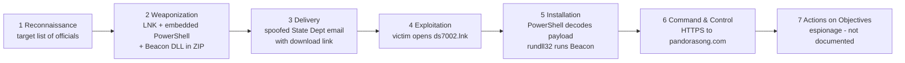

# Week 4 — Cyber Kill Chain Analysis of a Real-World Attack

**Task (syllabus §3.3):** analyze a real-world cyberattack using the stages of the Lockheed Martin Cyber Kill Chain and map each stage to the corresponding MITRE ATT&CK tactics and techniques.

**Case study:** suspected **APT29** spear-phishing campaign, November 2018, investigated by FireEye / Mandiant.

## 1. Why this case

This campaign is a textbook example of the chain this project studies — *spear-phishing → user opens a file → PowerShell → post-exploitation framework*:

- initial access through a spear-phishing **link** impersonating a trusted government sender;
- execution through an **obfuscated, base64-encoded PowerShell** command hidden inside a Windows shortcut (LNK);
- final payload **Cobalt Strike Beacon** — the same framework found on `192.227.152[.]240` in week 2;
- the actor (APT29) is the group selected for week 10, so this analysis prepares the final assignment.

## 2. Campaign summary

| Item | Details |
|---|---|
| Date | Phishing wave on **14 November 2018** (first email 08:23 UTC); infrastructure prepared from ~15 October 2018 |
| Attribution | Suspected APT29; FireEye rated confidence low-to-moderate (overlaps with APT29's November 2016 campaign) |
| Scale | Targeted phishing observed at more than 20 FireEye customers; most received ≤ 3 emails, one received 136 |
| Sectors | Government, military and defense, law enforcement, think tanks, media, pharmaceutical, transportation, imagery |
| Lure | Email posing as a U.S. Department of State public-affairs official sharing a document ("TP18-DS7002"), with a unique tracking link per recipient |
| Delivery infrastructure | Sender address on a likely compromised hospital mail server; ZIP hosted on a likely compromised consulting company website |
| Execution | `ds7002.zip` → `ds7002.lnk` → obfuscated PowerShell (`-noni -ep bypass`, base64) → decoy PDF opened + Beacon DLL dropped and run via `rundll32.exe` |
| C2 | Cobalt Strike Beacon over HTTPS (TCP/443) to `pandorasong[.]com`, using a modified public Malleable C2 profile that imitates Pandora music-streaming traffic |

## 3. Attack flow

## 4. Kill Chain → ATT&CK mapping

| # | Kill Chain stage | What happened in this campaign | ATT&CK tactic | ATT&CK technique(s) |
|---|---|---|---|---|
| 1 | **Reconnaissance** | Recipients were specific officials and organizations; some had also been targeted in APT29's 2016 wave, i.e. the actor maintained a target list | Reconnaissance | **T1589.002** Gather Victim Identity Information: Email Addresses; **T1591** Gather Victim Org Information *(inferred from targeting)* |
| 2 | **Weaponization** | Domain `pandorasong[.]com` registered with privacy protection; hospital mail server and consulting website likely compromised; Cobalt Strike prepared with a customised C2 profile; LNK built with PowerShell and payload embedded at fixed offsets | Resource Development | **T1583.001** Acquire Infrastructure: Domains; **T1584** Compromise Infrastructure; **T1588.002** Obtain Capabilities: Tool (Cobalt Strike); **T1608.001** Stage Capabilities: Upload Malware |
| 3 | **Delivery** | Email spoofing a State Department sender with a link to `ds7002.zip`; the server returned a benign ZIP to requests with unexpected HTTP headers (filtering out analysts and sandboxes) | Initial Access | **T1566.002** Phishing: Spearphishing Link; **T1656** Impersonation |
| 4 | **Exploitation** | No software vulnerability was exploited — the "exploit" is the user opening the shortcut file | Execution | **T1204.001** User Execution: Malicious Link; **T1204.002** User Execution: Malicious File |
| 5 | **Installation** | LNK launches obfuscated PowerShell (`-noni -ep bypass`, base64, split strings such as `'FromBase'+0x40+'String'`); script decodes embedded data, opens a decoy PDF from `%TEMP%`, drops the Beacon loader as `%LOCALAPPDATA%\cyzfc.dat` and runs it with `rundll32.exe` | Execution, Defense Evasion | **T1059.001** Command and Scripting Interpreter: PowerShell; **T1027** Obfuscated Files or Information; **T1140** Deobfuscate/Decode Files or Information; **T1218.011** System Binary Proxy Execution: Rundll32; **T1036** Masquerading (DLL named `.dat`, decoy PDF) |
| 6 | **Command & Control** | Beacon calls back every ~300 s (17 % jitter) over HTTPS to `pandorasong[.]com`, with URIs mimicking Pandora traffic; configured to inject into `rundll32.exe` | Command and Control, Defense Evasion | **T1071.001** Application Layer Protocol: Web Protocols; **T1573.002** Encrypted Channel: Asymmetric Cryptography; **T1001.003** Data Obfuscation: Protocol Impersonation; **T1055** Process Injection |
| 7 | **Actions on Objectives** | Not described in the public report (FireEye noted that incident-response data would be needed). Based on APT29's known mission, the expected goal is espionage: collection and exfiltration of government and policy information | Collection, Exfiltration *(expected)* | e.g. **T1005** Data from Local System; **T1041** Exfiltration Over C2 Channel *(not observed — expected based on actor profile)* |

**Note on persistence:** the report does not document a persistence mechanism (no registry Run key or scheduled task is described), so none is mapped. Mappings marked *inferred* or *expected* are the analyst's assessment, not observed facts.

## 5. Kill Chain vs. MITRE ATT&CK

| Aspect | Lockheed Martin Cyber Kill Chain | MITRE ATT&CK |
|---|---|---|
| Granularity | 7 high-level stages | 14 tactics, hundreds of techniques and sub-techniques |
| Focus | *When* in the intrusion something happens | *How* the adversary does it |
| Pre-compromise | Explicit (Reconnaissance, Weaponization) | Covered by Reconnaissance and Resource Development tactics |
| Post-compromise | Compressed into Installation, C2 and Actions | Very detailed (Persistence, Privilege Escalation, Lateral Movement, etc.) |
| Best use | Explaining an attack and choosing where to break it | Building detections and hunts for specific behaviours |

**What the mapping showed:**

- Kill Chain stage 5 (*Installation*) alone corresponds to **5 ATT&CK techniques** — the Kill Chain tells *where* to look, ATT&CK tells *what* to look for.
- Stage 4 (*Exploitation*) needed no exploit at all. In phishing campaigns "exploitation" is the human decision to open a file, which is why user awareness and execution controls (blocking LNK/macros from the internet) matter as much as patching.
- Stage 7 could not be filled from public data — a real limitation of OSINT-based analysis compared with incident-response data.

## 6. Defensive opportunities per stage

The core idea of *Intelligence-Driven Defense* (Lockheed Martin): the defender only needs to break **one** link in the chain.

| Stage | Detection / prevention opportunity | Data source |
|---|---|---|
| Delivery | SPF/DKIM/DMARC failure for a sender claiming a government domain; link to a ZIP on an unrelated website | Email gateway logs |
| Exploitation | `.lnk` file launched from a downloaded ZIP / Downloads folder | EDR, Sysmon Event ID 1 |
| Installation | `powershell.exe` started by `explorer.exe` from an LNK with `-ep bypass`, `-noni` and base64 content; **PowerShell Script Block Logging (Event ID 4104)** shows the decoded script | Sysmon 1, PowerShell 4104 |
| Installation | `rundll32.exe` loading a file with a non-DLL extension (`.dat`) from `%LOCALAPPDATA%` | Sysmon 1 / 7 |
| C2 | Regular HTTPS beaconing (~5 min interval) to a recently registered domain imitating a well-known service | Proxy / DNS logs |

The Installation-stage detections are the most durable: domains, hashes and C2 addresses changed between APT29's 2016 and 2018 campaigns, but the *behaviour* — an obfuscated PowerShell launched from a user-opened file — stayed the same. This is the basis for the **week 5 hunting hypothesis**:

> *Adversaries in our environment execute obfuscated or encoded PowerShell launched from user-opened files (LNK shortcuts or Office documents) to download or decode a second-stage payload.*

## 7. Link to previous weeks

| Week | Connection |
|---|---|
| 1 | Kill Chain and ATT&CK defined in the glossary are now applied to a real case |
| 2 | Cobalt Strike PowerShell loader found on `192.227.152[.]240` matches the payload type of this campaign |
| 3 | The ATT&CK techniques mapped here (T1566, T1059.001, T1105) were already used as galaxy tags on the MISP event |

## References

- FireEye / Mandiant — *Not So Cozy: An Uncomfortable Examination of a Suspected APT29 Phishing Campaign* (19 Nov 2018): https://cloud.google.com/blog/topics/threat-intelligence/not-so-cozy-an-uncomfortable-examination-of-a-suspected-apt29-phishing-campaign/
- Lockheed Martin — *Intelligence-Driven Computer Network Defense Informed by Analysis of Adversary Campaigns and Intrusion Kill Chains* (Hutchins, Cloppert, Amin)
- MITRE ATT&CK — APT29 (G0016): https://attack.mitre.org/groups/G0016/
- C. Maurice, *The Foundations of Threat Hunting*, 2022
